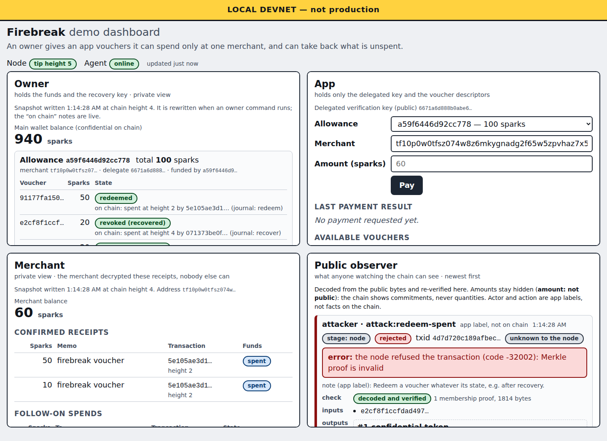

# Firebreak

**Chain-enforced spending allowances for apps and AI agents, on
[Flame](https://github.com/runflame/flame-lib).**

*Second prize, Build on Flame challenge, btc++ Berlin 2026.*

Apps and AI agents increasingly need to pay for things, and today that means handing them a wallet
key: everything, spendable anywhere. Firebreak gives them a limited key instead. The owner sets
aside an allowance for one merchant. The app can pay that merchant, up to the allowance, and
nothing else, even if its key leaks: the chain itself refuses any other use. Amounts stay private
on the public chain, and the owner can take back whatever the app has not spent, at any time.



## Try it

```sh
git clone https://github.com/zeenix/firebreak && cd firebreak
scripts/demo.sh          # pauses before each step; the dashboard is at http://127.0.0.1:7742
scripts/demo.sh --auto   # runs straight through and checks the final balances
```

It needs `rustup`, `git`, `curl` and `jq`, and is tested on Linux. The first run fetches Flame at a
pinned revision and builds everything in release mode, which takes a few minutes. Everything runs
on a **local Flame devnet** that the script starts: real node, real transactions, fresh keys.

## What you will see

An owner with 1,000 sparks gives an app an allowance of 100 for one merchant, as four vouchers of
50, 20, 20 and 10. Then:

1. **The app's key leaks, and stealing with it fails.** The attacker builds its own transactions
   and submits them straight to the node, bypassing the app. Every attempt is refused, and the
   money doesn't move:

   ```text
   $ firebreak-attack attempt owner-branch
   attack owner-branch: Open the owner's recovery branch, sign its authorization with the …
     target voucher  91177fa1… (50 sparks, unspent)
     signed with     the delegated key
     local verifier  REFUSED: Deferred batch signature verification failed
     node            REFUSED: … (code -32002): Deferred batch signature verification failed
     voucher after   unspent
   => stopped: the node refused it
   ```

2. **The app pays 60**, using the 50 and the 10 vouchers. Asking for 110 is refused.
3. **The merchant receives it privately.** A public observer sees that transactions happened, but
   never the amounts. The merchant opens its receipts and spends the 60 like any other payment.
4. **The owner takes back the unused 40** with its own key alone, and a recovered voucher cannot be
   spent again.

Final balances: owner 940, merchant 60, allowance 0. The devnet charges no fees.

The owner's, the merchant's and the attacker's actions are separate command-line programs, each
with its own keys; the dashboard shows all four points of view and pays through the app. To poke at
the attacker yourself while the demo runs:

```sh
target/release/firebreak-attack list      # every attack it knows
target/release/firebreak-attack matrix    # run all of them; each must be refused
```

There is also an optional MCP server that gives an AI model only the app's `pay` operation: see
[docs/ai-tool.md](docs/ai-tool.md).

## How it works

An allowance is a set of **fixed-value, single-use vouchers**. Each voucher is a Flame contract
that locks a confidential token together with a receipt: the encrypted payment note the merchant
will need, sealed to the merchant before the voucher is funded. The contract has no key that can
spend it directly, only exactly two programs:

- **Redeem**: requires a signature by the app's delegated key, pays the whole token to the
  merchant's address, and publishes the fixed receipt right after it. It takes no arguments: the
  destination, the amount and the receipt are all fixed when the voucher is funded.
- **Recover**: requires a signature by the owner's key and pays the token back into the owner's
  wallet.

Both signatures cover the whole transaction, so neither key can be reused for something else. The
merchant's ordinary wallet finds the payment, opens the receipt with its viewing key, checks it
against the token, and spends it like any other output.

[docs/threat-model.md](docs/threat-model.md) states the adversary, the invariant, the evidence for
each claim (every attack, the stage that stopped it, and its exact error), and what Firebreak does
not claim. [docs/architecture.md](docs/architecture.md) shows the scripts of every transaction.

### Why vouchers instead of arbitrary amounts

Flame validates token commitments and spending rules, but a malformed encrypted payment note is not
invalid at the chain layer. If the untrusted app chose fresh change outputs and their notes during
a payment, it could make funds unrecoverable. Fixing every voucher's destination and receipt before
delegation removes that hazard. The price is denominations: a payment must match a subset of the
remaining vouchers exactly, like paying with exact cash.

## Components

- `firebreak-core`: the voucher programs and predicate tree; the funding, redemption and recovery
  transactions; signing; the node client, stores and journal.
- `firebreak-owner`: the owner's command line. It holds the owner's wallet and the vouchers'
  openings, and creates and recovers allowances.
- `firebreak-agent`: the app. It holds only the delegated key, and pays from the allowance through
  a narrow API.
- `firebreak-merchant`: the merchant's command line. It finds payments, opens their receipts, and
  spends what it received.
- `firebreak-attack`: the adversary. It builds and submits unauthorized transactions with the
  delegated key.
- `firebreak-demo`: the local dashboard, with owner, app, merchant and public-observer views.
- `firebreak-mcp`: the optional AI tool.

Every component that touches the chain uses Flame: `flamevm` for the contract, scripts, proofs and
signatures, `flamepayments` for keys, notes and ordinary transfers, `flamechain` for transaction
packaging and membership proofs, and `flamed` as the node, over its JSON-RPC interface.

Each role keeps its keys under `.firebreak/<role>/`, which git ignores; `.firebreak/public/` holds
only what the roles publish to each other. The attacker's `attacker/attacker.json` is just the
attacker's own disposable wallet, where it tries to pay itself.

## Building

Firebreak builds against a pinned Flame revision through local path dependencies. The demo script
does all of this itself; to build by hand:

```sh
scripts/setup-flame.sh        # clones flame-lib at the pinned revision and applies the local patch
cargo build --release
cargo build --release --manifest-path flame-lib/Cargo.toml -p flamed --features devnet
```

- Flame revision: `8021a125da8febe0223a0f00e407887bd60d136f` of
  [runflame/flame-lib](https://github.com/runflame/flame-lib) (the toolchain, 1.90.0, and the
  dependency versions in `Cargo.lock` are Flame's own).
- Local patch: [`0001-flamepayments-prepare-output.patch`][patch] in `patches/flame-lib/` adds
  `flamepayments::prepare_output`, which seals an output's note with Flame's existing note code
  ahead of the transaction that publishes the output. It exposes no shared secret and adds no new
  encryption.

## Testing

```sh
cargo test
```

The tests run every transaction against a real, in-process Flame node: the bytes are serialized,
decoded and verified the way the chain does, then admitted (or refused) by the node's mempool and
confirmed in blocks.

- `crates/firebreak-core/tests/lifecycle.rs`: fund 50, 20, 20 and 10 out of 1,000; redeem 60 with
  the delegated key alone; the merchant opens the receipts and spends 60; the owner recovers 40
  with its own key alone and spends it; a recovered voucher cannot be redeemed; final balances are
  owner 940, merchant 60, allowance 0.
- `crates/firebreak-core/tests/rpc_lifecycle.rs`: the same through the node's JSON-RPC interface,
  including a stale membership proof that is refused, then accepted once refreshed.
- `crates/firebreak-attack/tests/matrix.rs` and `cli.rs`: the attack matrix, directly against the
  node and through the attack command line. See [docs/threat-model.md](docs/threat-model.md).
- `crates/firebreak-owner/tests`, `crates/firebreak-merchant/tests`, `crates/firebreak-agent/tests`:
  every command of each role against a node served over JSON-RPC, including openings saved before
  the funding is broadcast, lost replies, stale proofs, a recovery racing a redemption, and the
  agent's refusals (another merchant, no exact combination of vouchers, insufficient authority).
- `crates/firebreak-demo` and `crates/firebreak-mcp`: the dashboard's public view of real
  transactions, which never shows an amount, and the AI tool's protocol handling.

## License and scope of original work

Firebreak is a hackathon prototype for the Build on Flame challenge at btc++ Berlin 2026. Flame is
Apache-2.0 and is not vendored: `scripts/setup-flame.sh` fetches it, and the only change to it is
the patch above. Everything under `crates/`, `scripts/`, `patches/` and `docs/` is original work for
this hackathon.

[patch]: patches/flame-lib/0001-flamepayments-prepare-output.patch
